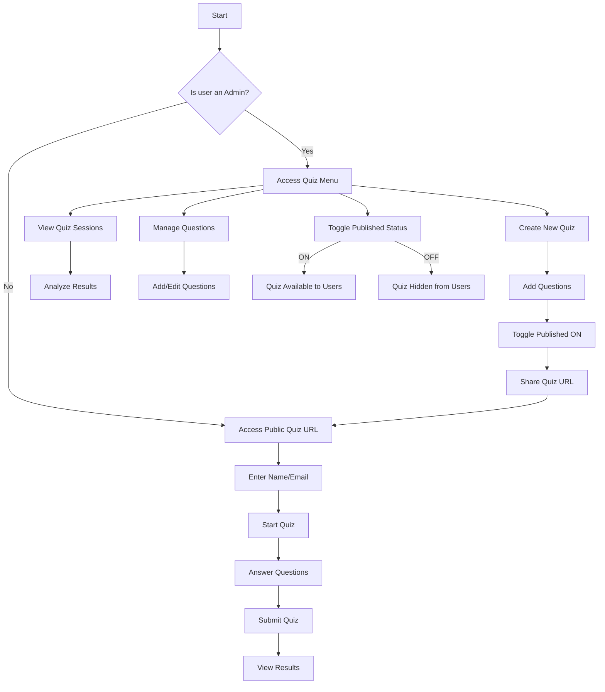

# Quiz Module Workflow

The diagram above illustrates the primary workflows for administrators and end users within the Quiz module.

## Administrator Workflow

Administrators follow this process:
1. Access the Quiz menu
2. Create a new quiz with settings
3. Add various types of questions
4. Toggle the Published status ON
5. Share the quiz URL with users
6. View and analyze quiz sessions

## End User Workflow

Users follow this process:
1. Access the public quiz URL
2. Enter their name and email
3. Start the quiz
4. Answer each question
5. Submit the quiz
6. View their results

## Enabling/Disabling Quiz Workflow

The administrator can easily control quiz availability:
- Toggle Published ON: Quiz becomes available to all users
- Toggle Published OFF: Quiz becomes hidden from all users

This simple control allows for preparing quizzes in advance and making them available only when needed.
